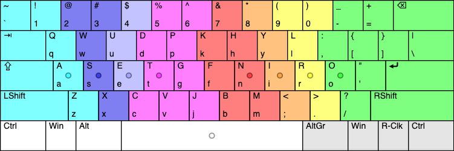
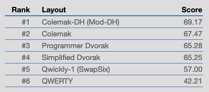
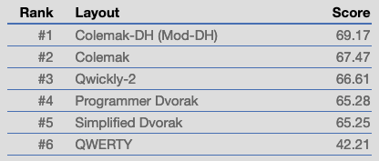
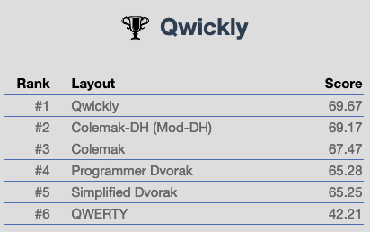

#### Easier to learn and faster than Colemak for English writing.




Read the blog post [How Qwickly came to be](https://blog.keithkim.org/opensource/making-the-qwickest-keyboard-layout) and [part 2](https://blog.keithkim.org/opensource/keyboard-layouts/mtgap-+-colemak-+-soul-+-niro).

## Qwickly (step 1)

Answers the question "What's the minimal changes to make QWERTY suck less?"

Let's get the most [frequently occurring letters](https://en.wikipedia.org/wiki/Letter_frequency) in home positions. `A` and `S` are already there.

Swap the frequently occurring letters: `E`, `T`, `N`, `I`, `O`, `P`<br/>
with the letters above or below them: `D`, `F`, `J`, `K`, `L`, `;`.

*(`R` occurs more than `P` but we'll get it in the next step)*
```
 Q   W  ·D·  R  ·F·  Y   U  ·K· ·L· ·;·  [   ]

  A   S  ·E· ·T·  G   H  ·N· ·I· ·O· ·P·  '          Legend
                                                    |     same as QWERTY
   Z   X   C   V   B   ·J·  M   ,   .   /           | · · on same finger
```
The keys `ASET GH NIOP` uses the same muscle-memory from QWERTY--just not moving fingers off the home row.<br/>
With this layout, you will start off missing some keys but that's okay since the letter you want is immediatly next to the miss and very easy to correct. This ability makes this first step as painless as can be.<br/>
he `F` can be tricky but that doesn't much matter as we'll change it soon. Switch to **Qwickly (step 2)** as soon as you're comfortable with the home row.

It turns out that this is not a far-fetched idea and [another has already discovered it](https://www.youtube.com/watch?v=9JMhIDGfquU&feature=youtu.be) (youtube) and called it `SwapSix`.

How are we doing? Here's the `Qwickly-1 (SwapSix)` score ranking for "1984" on the [stevep99 keyboard analyzer](https://stevep99.github.io/keyboard-layout-analyzer/#/main):



## Qwickly (step 2)

Next we want `R` in a home position and we'll shuffle `O`, `P`, `U`, and `D` as well. It may not be obvious why these were chosen, which has to do with ultimately reducing finger travel and [common English bi-grams](https://en.wikipedia.org/wiki/Bigram#Bigram_frequency_in_the_English_language) on the same finger which are slower and less comfortable to type.

```
 Q   W  <U> (D) ·F·  Y  (P) ·K· ·L· ·;·  [   ]
                                                    |     same as QWERTY
  A   S  ·E· ·T·  G   H  ·N· ·I· <R> (O)  '         | · · same finger
                                                    | ( ) same hand
   Z   X   C   V   B   ·J·  M   ,   .   /           | < > other hand
```
The ring and index fingers press the `X` and `C`, with the middle finger only pressing `U` and `E`. The right hand middle finger does press `,`/`<`.

Here we're mainly learning the new `U`/`D` and `R`/`O` positions.<br/>
Again don't mind not fully learning `F` and `P`, switch to **Qwickly** as soon as this layout starts to get comfortable.

What's our progress now? Here's the `Qwickly-2` score ranking for "1984" on the [stevep99 keyboard analyzer](https://stevep99.github.io/keyboard-layout-analyzer/#/main):



## Qwickly

Qwickly-2 is a solid layout in itself. We are now putting on the finishing touches.

Swap the following letters:
- `F`, `P`, `H` (rotate 3 keys)
- `K` with `Y`
- `J` with `B`
- `,` with `;` (note that the shifted `<` and `:` don't move)

```
 Q   W  <U> (D) <P> (K) ·H· (Y) ·L· (,)  [   ]
                                                    |     same as QWERTY
  A   S  ·E· ·T·  G  <F> ·N· ·I· <R> (O)  '         | · · same finger
                                                    | ( ) same hand
   Z   X   C   V  <J>  <B>  M  (;)  .   /           | < > other hand
```

The main thing to learn is the new placement of `H`/`F`/`P` keys as the other changed keys don't come up as often. Having the comma so close by should be a nice perk.

Here's the final `Qwickly` score ranking for "1984" on the [stevep99 keyboard analyzer](https://stevep99.github.io/keyboard-layout-analyzer/#/main):


